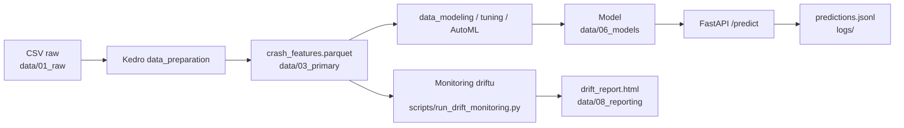

# Architektura projektu

Projekt dzieli się na trzy warstwy: dane, modelowanie i aplikacja. Spina je framework Kedro (pipeline'y) oraz FastAPI (serwowanie modelu).

## Przepływ danych

Diagram do edycji: `docs/architecture.drawio`. Poniżej uproszczony przepływ:



## Warstwy

### 1. Dane — `src/crash_kedro/pipelines/data_preparation/`

Czyszczenie, inżynieria cech i enkodowanie:
1. Wczytanie CSV (`data/01_raw/`)
2. Usunięcie niepotrzebnych kolumn
3. Imputacja braków (moda dla tekstu, mediana dla liczb)
4. Inżynieria cech (godzina/dzień/miesiąc, wiek pojazdu, cechy binarne)
5. Mapowanie klasy docelowej na 3 grupy (NO_INJURY, MINOR, SERIOUS)
6. Enkodowanie zmiennych kategorycznych
7. Zapis do `data/03_primary/crash_features.parquet` + `data/06_models/encoders.pkl`

Funkcje: `drop_unnecessary_columns`, `clean_missing_values`, `engineer_features`, `map_target`, `encode_features` (`nodes.py`).

### 2. Modelowanie

- `data_modeling/` — trening baseline (Random Forest) + ewaluacja
- `hyperparameter_tuning/` — Grid Search, Random Search, Optuna
- `automl/` — porównanie kilku modeli sklearn
- `autogluon/` — AutoML (AutoGluon)
- `feature_selection/` — SelectKBest

Wyjścia: modele w `data/06_models/*.pkl`, metryki w `data/08_reporting/*.json`, eksperymenty w MLflow.

### 3. Aplikacja — `src/crash_kedro/api/` + `src/crash_kedro/ui/`

- `api/app.py` — FastAPI: `POST /predict`, `GET /health`, `GET /predictions/recent`
- `api/predictor.py` — funkcje pomocnicze (klient API, formatowanie)
- `ui/streamlit_app.py` — frontend Streamlit korzystający z API

API ładuje model (zmienna `MODEL_PATH` lub katalog `data/06_models/`), transformuje wejście enkoderami, zwraca predykcję i loguje ją do `logs/predictions.jsonl`.

## Pipeline'y Kedro

```python
# src/crash_kedro/pipeline_registry.py
pipelines = {
    "__default__": data_preparation + data_modeling,
    "data_processing": data_preparation,
    "modeling": data_modeling,
    "tuning": data_preparation + tuning,
    "automl": data_preparation + automl,
    "autogluon": data_preparation + autogluon,
    "feature_selection": data_preparation + feature_selection,
}
```

Pipeline'y z cięższymi bibliotekami (tuning, automl, autogluon, feature_selection) ładują się warunkowo — jeśli brakuje zależności, są pomijane z ostrzeżeniem.

## Konfiguracja (Kedro)

Parametry i ścieżki są wydzielone w `conf/base/`:

- `parameters.yml` — `test_size`, `random_state`, `severity_mapping`, `columns_to_drop`
- `catalog.yml` — definicje datasetów (raw CSV, parquet, modele, metryki)

Dzięki temu ścieżki i parametry można zmieniać bez ruszania kodu.

## Testy

```
tests/
├── test_run.py                       # rejestr pipeline'ów
├── api/test_app.py, test_predictor.py
├── pipelines/data_preparation/test_nodes.py
├── pipelines/data_modeling/test_nodes.py
└── utils/test_encoders.py
```

## CI/CD

GitHub Actions (`.github/workflows/`):
- `ci.yml` — testy (pytest) + linting (ruff, pylint) na każdy push
- `cd.yml` — build i push obrazu Dockera na tag `v*`
- `ct.yml` — ponowny trening + monitoring driftu na harmonogramie

## Monitoring

`src/crash_kedro/monitoring/drift_detector.py` + `scripts/run_drift_monitoring.py` — wykrywanie driftu danych przez Evidently, raport HTML + podsumowanie JSON w `data/08_reporting/`.
